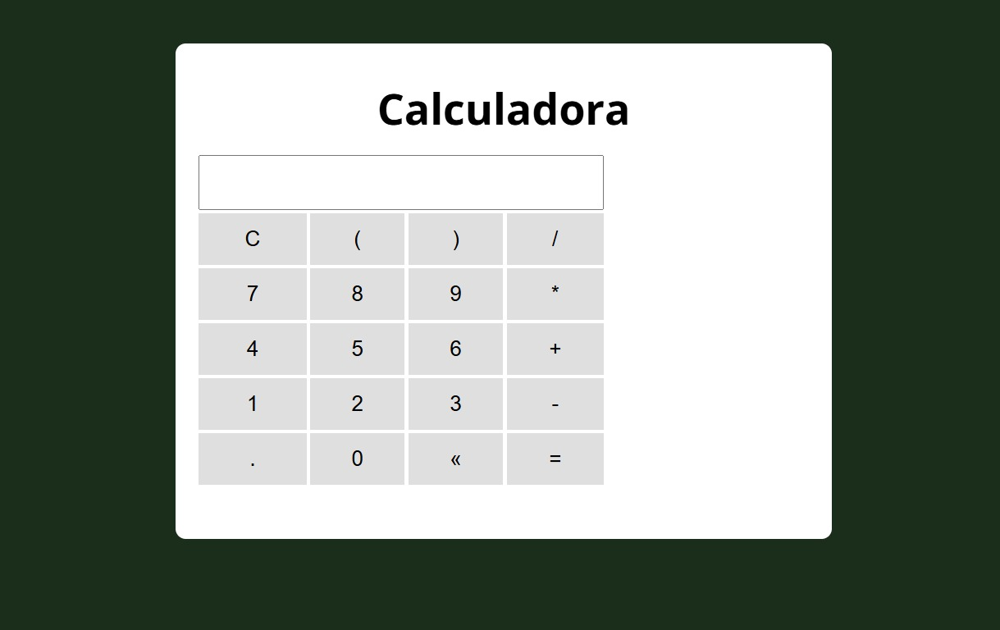

# 🧮 Calculator

## 📌 Descrição
Projeto de **calculadora digital** desenvolvida com HTML, CSS e JavaScript.  
A interface simula uma calculadora funcional com botões para números, operadores, parênteses, ponto decimal, limpar, apagar e calcular.

> O cálculo é feito diretamente no navegador, com suporte a expressões matemáticas simples.

---

## ⚙️ Funcionalidades
- Números de 0 a 9
- Operadores: `+`, `-`, `*`, `/`
- Parênteses: `(` e `)`
- Ponto decimal: `.`
- Botão **C** para limpar tudo
- Botão **«** para apagar o último caractere
- Botão **=** para calcular o resultado

---

## 🛠️ Tecnologias utilizadas
- HTML5
- CSS3
- JavaScript (JS)

---

## 📸 Preview


---

## 🚀 Como visualizar

Você pode abrir o projeto localmente:

1. Baixe ou clone este repositório:
   - Clique em **Code > Download ZIP** e extraia os arquivos  
   - ou use o comando:
     ```bash
     git clone https://github.com/WellingthonSchuh/Calculator.git
     ```

2. Abra o arquivo `index.html` em qualquer navegador moderno.

Ou

1. Acesse o site:
   - https://wellingthonschuh.github.io/Calculator/

> ⚠️ O projeto é totalmente seguro. Nenhum dado é armazenado — os cálculos são feitos localmente no navegador.

---

## 📚 Aprendizados
- Manipulação de eventos com JavaScript
- Criação de interface interativa com botões
- Avaliação de expressões com `eval()` (com cuidado!)
- Organização visual com grid layout

---

## 👨‍💻 Autor
Feito por **Wellingthon Schuh**  
🔗 [LinkedIn](https://www.linkedin.com/in/wellingthonschuh)
